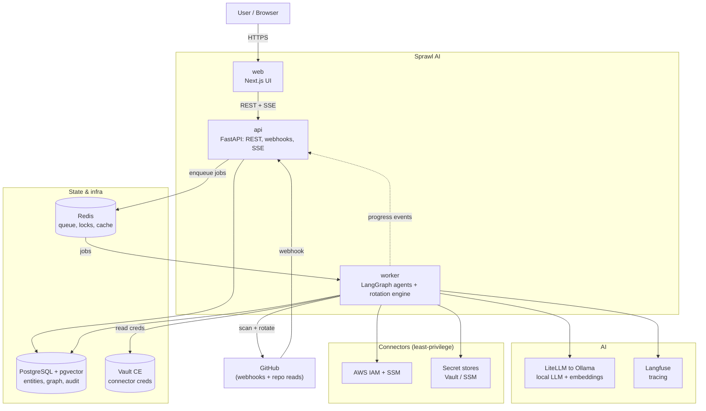

# Sprawl AI

**Find your exposed secrets, see exactly what each one can blow up, and rotate them safely.**

Sprawl AI is an AI-agent-powered DevSecOps platform that detects exposed secrets and
credentials, **visually maps their blast radius**, and orchestrates **safe, guided
rotation**. *"Secret sprawl"* is the problem we fight: credentials scattered across
repos, cloud, CI, and env files.

Unlike scanners that stop at a list of alerts, Sprawl AI closes the loop:

> **"a key leaked"** → **"here's everything it touches"** → **"rotated safely, prod never broke."**

---

## Why it exists

The industry has over-invested in **detection** and under-invested in **consequence +
remediation**. Teams get hundreds of leak alerts but can't answer the questions that
matter, and they delay rotating live credentials for weeks because it might break prod.

Sprawl AI focuses on the expensive, scary, neglected work:

- **Where is this credential actually used?** (repos, CI, k8s, env files, cloud resources)
- **What can it access / what's the blast radius?** (IAM scope, prod vs staging)
- **How do I rotate it safely** without breaking production?

Detection is a commodity we **reuse** (gitleaks / TruffleHog), not rebuild.

---

## Dual USP

1. **Multi-agent AI backend (LangGraph)** that autonomously investigates a secret, maps
   everything it can reach, assesses severity, and plans/executes rotation.
2. **Rich visual frontend** that turns "a key leaked" into an interactive
   **blast-radius graph** plus an animated, human-approved rotation flow.

---

## Core principles

- **DAU driver = continuous secret posture management**, not just reactive leak alerts
  (inventory, staleness/age, scheduled rotation, over-privilege detection, drift between
  secret manager and code, a live blast-radius graph for *every* secret).
- **Blast-radius intelligence is the visual centerpiece** (force-directed graph:
  secret → services/repos/envs/cloud resources → what each can access).
- **Rotation is SAFE and human-in-the-loop (MVP):** agents propose a plan, the user
  approves, one-click execute. Hard rule: **verify the new secret works everywhere
  BEFORE revoking the old one**, with automatic rollback. Full autonomy is v2.
- **Go deep on ONE stack first:** GitHub + AWS (IAM + SSM Parameter Store), with
  HashiCorp Vault CE as the default secret store.

---

## What it IS vs IS NOT

| ✅ IS | ❌ IS NOT (at least not MVP) |
|---|---|
| A consequence + remediation layer on top of detection | A new secret scanner |
| A blast-radius mapping & visualization engine | A generic CSPM / cloud security suite |
| A safe, human-in-the-loop rotation orchestrator | A fully autonomous unattended rotation bot (v2) |
| Continuous secret posture management | A SIEM / log analytics platform |
| Deep on GitHub + AWS | Broad/shallow across every cloud + SCM on day one |
| A pluggable integrator with external secret managers (connector model — HashiCorp Vault CE default, AWS SSM/IAM; AWS Secrets Manager in v1) | A secrets vault itself |

---

## Tech stack (finalized — see [Phase 4](./specs/04-tech-stack.md))

- **Frontend:** Next.js (App Router) + TypeScript + Tailwind + shadcn/ui; graph viz via **React Flow**.
- **Agent + API service:** Python + FastAPI + **LangGraph**; **Langfuse** (OSS) tracing.
- **LLM:** provider-agnostic via **LiteLLM**, default **local Ollama** ($0 / self-host), hosted API opt-in.
- **Ingestion:** Python for MVP (a dedicated **Go** service is a v1 upgrade).
- **Secret stores:** **HashiCorp Vault** (default) + **AWS SSM/IAM**; AWS Secrets Manager in v1.
- **Data:** **PostgreSQL + pgvector** (incl. blast-radius graph + audit); **Redis** for queue/cache/locks.
- **Rotation engine:** Postgres-backed durable state machine (MVP); **Temporal** in v1.
- **Infra:** **Docker Compose** (canonical self-host artifact); hosted demo on Fly.io / Railway.

---

## Architecture at a glance

A high-level view of how Sprawl AI fits together. The **agents and the rotation engine
run in the `worker`**; the `api` only triggers work and streams results, and the `web` UI
never touches the database or connectors directly. For the detailed diagrams see
[Phase 6](./specs/06-architecture-flow.md) and [Phase 7](./specs/07-system-design-hld.md).

---

## Project status

Sprawl AI is in a **planning-first, approval-gated** design process. We move through
planning phases one at a time; each is documented under [`specs/`](./specs). No
implementation begins until all planning phases are approved.

### Specs index

| Phase | Document |
|---|---|
| 1 | [Product Definition](./specs/01-product-definition.md) |
| 2 | [Capabilities & Scope](./specs/02-capabilities-scope.md) |
| 3 | [Product Spec (PRD)](./specs/03-prd.md) |
| 4 | [Tech Stack](./specs/04-tech-stack.md) |
| 5 | [Tech Spec](./specs/05-tech-spec.md) |
| 6 | [Architecture Flow](./specs/06-architecture-flow.md) |
| 7 | [System Design — HLD](./specs/07-system-design-hld.md) |
| 8 | [System Design — LLD + DB Design](./specs/08-system-design-lld-db.md) |
