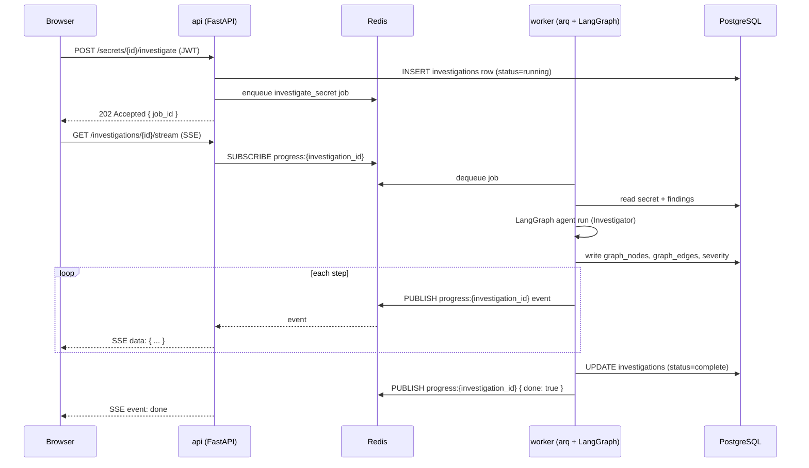

## Two request patterns

Sprawl AI has two distinct request patterns that are worth understanding separately:

1. **Synchronous REST requests** — CRUD, queries, status checks
2. **Agent/rotation jobs** — long-running, asynchronous, streamed back via SSE

## Synchronous REST request

```
Browser
  │
  ▼ HTTP request
api (FastAPI)
  ├─ auth middleware: validate JWT
  ├─ router handler
  │   └─ db/session.py: SQLAlchemy async query to PostgreSQL
  └─ return JSON response
```

Simple reads and writes (e.g. listing secrets, querying blast-radius graph nodes) follow the standard FastAPI request/response pattern. The `api` service reads from PostgreSQL directly via the SQLAlchemy async session in `api/db/session.py`.

## Agent / rotation job

This is the main async pattern. Here's the full lifecycle for "investigate this secret":



Key points:
- `api` **never awaits** the agent run. It enqueues and returns `202 Accepted` immediately.
- Progress events flow: `worker` → Redis pub/sub → `api` SSE fan-out → browser.
- The investigation row in PostgreSQL is the durable source of truth; Redis is ephemeral.

## GitHub webhook flow

```
GitHub App
  │
  ▼ POST /webhooks/github (HMAC-verified)
api
  ├─ validate X-Hub-Signature-256
  ├─ determine event type (push, installation, etc.)
  ├─ INSERT scan row (status=queued)
  └─ enqueue scan_repo job → Redis

worker
  ├─ dequeue scan_repo
  ├─ clone/fetch repo via GitHub App token
  ├─ run gitleaks / detection
  ├─ INSERT findings + secrets
  └─ enqueue investigate_secret for each new finding
```

## Rotation lifecycle

Rotation is executed by a **deterministic Postgres-backed state machine** in `worker`. The `RotationStatus` enum in `shared/models/enums.py` defines all states. See [Verify before revoke](/architecture/verify-before-revoke) for the safety model.

```
proposed → pending_approval → provisioning → distributing
         → verifying → awaiting_confirmation → revoking → completed

         On failure at any step after provisioning:
         → rolling_back → rolled_back (old secret still valid)
```

The `one_active_rotation` partial unique index on `rotations.secret_id` ensures at most one non-terminal rotation is in flight per secret at any time.
