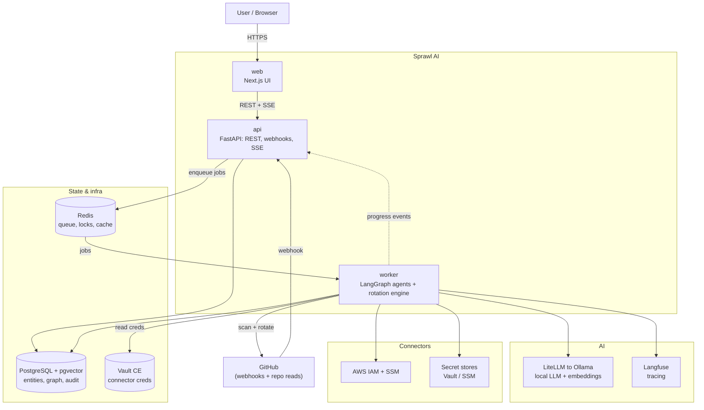

## Architecture diagram



## Boundary rules

Two rules govern where code can run:

**1. Only `api` and `worker` touch the database and secret stores.**

The `web` frontend never talks to PostgreSQL, Vault, or any connector directly. It only calls the FastAPI `api` over REST/SSE. This keeps the credential surface inside the backend and makes the web layer stateless.

**2. Agent execution belongs in `worker`, not `api`.**

`api` receives a request (e.g. "investigate this secret"), enqueues a job to Redis, and immediately returns a job ID. The LangGraph agent runtime runs in `worker` — in the background, non-blocking, with checkpoint/resume support. `api` then streams progress events from Redis pub/sub back to the browser via Server-Sent Events (SSE).

## Data flow at a glance

```
Browser  →  api (REST)  →  Redis (job queue)  →  worker (LangGraph / arq)
                ↑                                        |
                └────────── SSE progress ←──────────────┘
                                                         |
                                                    PostgreSQL
                                                    (system of record)
```

## Component roles summary

| Component | Runtime | Primary job |
|---|---|---|
| web | Next.js (App Router) | UI, SSR, Auth.js session, SSE/WS client |
| api | FastAPI (Python) | REST API, GitHub webhooks, auth, enqueue work, serve SSE |
| worker | Python arq | History scans, LangGraph agent runtime, rotation state machine |
| postgres | PG 16 + pgvector | Entities, blast-radius graph, audit log, embeddings, rotation state |
| redis | Redis 7 | Job queue, run/state cache, per-secret rotation locks, rate-limit buckets |
| vault | Vault CE | Stores connector credentials; also a connector type itself |
| ollama | Ollama | Local LLM + embeddings (default $0 provider) |
| langfuse | Langfuse | Agent/LLM trace sink |

For per-service detail see [Service topology](/architecture/service-topology). For how a request travels end-to-end see [Request & job lifecycle](/architecture/request-job-lifecycle).
