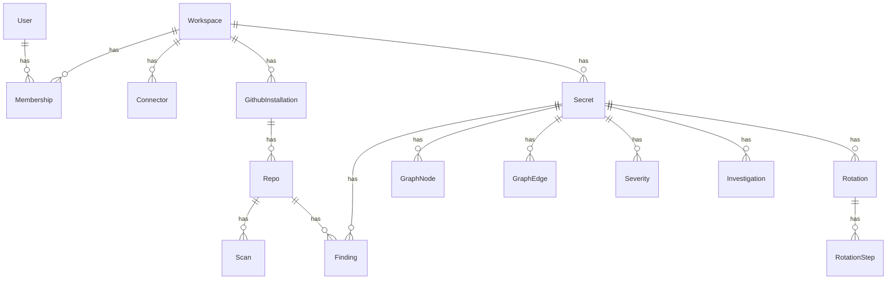

<Info>
  **Status: Implemented (M0)** — All tables are defined in SQLAlchemy models and created by migration `0001_initial_schema.py`. Business data populates them from M2 onward.
</Info>

All ORM models live under `api/db/models/` and are registered in `api/db/models/__init__.py`. Every table carries a `workspace_id` foreign key for multi-tenancy (single-tenant MVP, forward-compatible).

## Entity relationship overview

## Identity & tenancy

### `workspaces`

Every piece of business data belongs to a workspace. Demo workspaces (`kind='demo'`) have an `expires_at` for TTL garbage collection.

| Column | Type | Notes |
|---|---|---|
| `id` | UUID | PK, gen_random_uuid() |
| `name` | text | |
| `kind` | `workspace_kind` | `standard` \| `demo` |
| `demo_session_id` | text (nullable) | For demo TTL GC |
| `expires_at` | timestamptz (nullable) | GC sweep target |
| `created_at` | timestamptz | |

### `users`

GitHub OAuth users. Auth is stateless JWT — no sessions table.

| Column | Type | Notes |
|---|---|---|
| `id` | UUID | PK |
| `github_id` | bigint | Unique — GitHub user numeric ID |
| `email` | text (nullable) | |
| `name` | text (nullable) | |
| `avatar_url` | text (nullable) | |

### `memberships`

Many-to-many join between users and workspaces, with role.

| Column | Type | Notes |
|---|---|---|
| `user_id` | UUID | PK (composite), FK → users |
| `workspace_id` | UUID | PK (composite), FK → workspaces |
| `role` | `role` | `owner` \| `approver` \| `viewer` |

## Connectors

### `connectors`

An external secret store or cloud auth target configured by the user.

| Column | Type | Notes |
|---|---|---|
| `type` | `connector_type` | `vault`, `aws_ssm`, `aws_iam`, etc. |
| `name` | text | Human label |
| `environment` | `environment` | `prod`, `staging`, `dev`, `unknown` |
| `connection` | JSONB | Non-secret connectivity config (host, region, etc.) |
| `vault_auth_handle` | text | Pointer into Vault — **credentials never stored here** |
| `capabilities` | JSONB | `{read, write, rotate, revoke}` probe result |
| `status` | `connector_status` | `untested` \| `verified` \| `degraded` \| `disabled` |

## GitHub source

### `github_installations`

A GitHub App installation (one per GitHub org/user).

| Column | Type | Notes |
|---|---|---|
| `installation_id` | bigint | Unique — GitHub's installation numeric ID |
| `account_login` | text | GitHub org or user login |

### `repos`

A repository under a GitHub installation.

| Column | Type | Notes |
|---|---|---|
| `installation_id` | UUID | FK → github_installations |
| `full_name` | text | `owner/repo` — unique per workspace |
| `default_branch` | text (nullable) | |

### `scans`

A scan run on a repo (history or incremental).

| Column | Type | Notes |
|---|---|---|
| `repo_id` | UUID | FK → repos |
| `type` | text | `history` \| `incremental` |
| `status` | `scan_status` | `queued` → `scanning` → `complete` \| `error` |
| `head_sha` | text | Resolved before insert (enables deduplication) |
| `forced` | bool | Forced scans bypass the same-sha dedupe partial index |
| `progress` | numeric (nullable) | 0.0–1.0 |

**Deduplication:** A partial unique index (`scans_dedupe`) prevents duplicate non-forced scans for the same `(repo_id, type, head_sha)` tuple.

## Secrets & findings

### `secrets`

The canonical identity of a leaked credential. The secret **value** is never stored — only a fingerprint (hash).

| Column | Type | Notes |
|---|---|---|
| `fingerprint` | text | Hash of the credential — **never the value** (C1) |
| `type` | text | `aws_iam_key`, `stripe`, etc. |
| `principal_ref` | JSONB (nullable) | Resolved IAM principal (no secret value) |
| `store_ref` | JSONB (nullable) | Where it's managed (Vault path / SSM ref) |
| `health` | `secret_health` | `unknown` \| `healthy` \| `at_risk` \| `exposed` |
| `exposure_status` | `exposure_status` | `live_inferred`, `public_leak`, `inactive`, `unknown` |
| `severity_score` | int (nullable) | 0–100, denormalized from latest `severities` row |
| `severity_bucket` | `severity_bucket` | `low` \| `medium` \| `high` \| `critical` |
| `rotatable` | bool | Whether rotation is supported for this secret type |

**Unique constraint:** `(workspace_id, fingerprint)` — one canonical Secret row per unique credential per workspace.

### `findings`

A single detection event — one file/line in one commit that matches a secret.

| Column | Type | Notes |
|---|---|---|
| `secret_id` | UUID (nullable) | FK → secrets (set after dedup/linking) |
| `repo_id` | UUID (nullable) | FK → repos |
| `detector` | text | `gitleaks` (default) |
| `rule_id` | text (nullable) | Detector rule that matched |
| `commit_sha` | text (nullable) | |
| `file_path` | text (nullable) | |
| `line` | int (nullable) | |
| `match_hash` | text | Hash of the matched value — **never the secret value** (C1) |
| `state` | `finding_state` | `new` → `triaged` → `confirmed` \| `false_positive` \| `ignored` |

## Blast-radius graph

### `graph_nodes`

Each node represents an entity in the blast-radius graph for a secret.

| Column | Type | Notes |
|---|---|---|
| `secret_id` | UUID | FK → secrets |
| `kind` | `node_kind` | `secret`, `location`, `ci`, `store_entry`, `principal`, `resource`, `environment` |
| `label` | text | Human-readable label |
| `environment` | `environment` | |
| `attrs` | JSONB | Kind-specific metadata |

### `graph_edges`

Directed edges between graph nodes.

| Column | Type | Notes |
|---|---|---|
| `secret_id` | UUID | FK → secrets (denormalized for fast per-secret queries) |
| `src_node_id` | UUID | FK → graph_nodes |
| `dst_node_id` | UUID | FK → graph_nodes |
| `kind` | `edge_kind` | `found_in`, `stored_in`, `is_principal`, `grants_access_to`, `used_by`, `can_access` |
| `confidence` | `confidence` | `high` \| `medium` \| `low` |
| `attrs` | JSONB | |

### `severities`

One row per severity computation. The latest score is denormalized onto `secrets.severity_score` / `secrets.severity_bucket` for fast sorting.

| Column | Type | Notes |
|---|---|---|
| `secret_id` | UUID | FK → secrets |
| `score` | int | Deterministic 0–100 |
| `factors` | JSONB | `{scope, environment, exposure}` breakdown |
| `explanation` | text (nullable) | LLM-generated (non-authoritative) |
| `computed_at` | timestamptz | |

## Investigations

### `investigations`

One row per LangGraph agent run investigating a secret.

| Column | Type | Notes |
|---|---|---|
| `secret_id` | UUID | FK → secrets |
| `status` | `investigation_status` | `running` \| `complete` \| `error` |
| `trace_id` | text (nullable) | Langfuse trace correlation |
| `coverage` | JSONB (nullable) | Known / unknown consumer breakdown |

**At most one in-flight investigation per secret** — enforced by the partial unique index `one_active_investigation` on `(secret_id WHERE status = 'running')`.

## Rotation state machine

### `rotations`

One row per rotation attempt on a secret.

| Column | Type | Notes |
|---|---|---|
| `secret_id` | UUID | FK → secrets |
| `status` | `rotation_status` | 13 states (see [Verify before revoke](/architecture/verify-before-revoke)) |
| `plan` | JSONB (nullable) | NULL in `proposed` / `plan_failed` states; required otherwise |
| `plan_error` | text (nullable) | Populated for `plan_failed` |
| `coverage` | JSONB | Consumer coverage tracking |
| `new_secret_ref` | JSONB (nullable) | Pointer to the new credential version |
| `plan_expires_at` | timestamptz (nullable) | Plan TTL — triggers `needs_replan` if elapsed |
| `created_by` | UUID (nullable) | FK → users |

**At most one active rotation per secret** — enforced by the partial unique index `one_active_rotation` on `(secret_id WHERE status NOT IN terminal_states)`.

### `rotation_steps`

One row per step in a rotation plan.

| Column | Type | Notes |
|---|---|---|
| `rotation_id` | UUID | FK → rotations |
| `idx` | int | Step order (0-based) |
| `kind` | `step_kind` | `provision`, `distribute`, `verify`, `revoke` |
| `target` | JSONB | `ConsumerRef` or `StoreRef` — no secret value |
| `compensation` | JSONB (nullable) | How to undo this step |
| `requires_confirmation` | bool | Whether a human must confirm before execution |
| `status` | `step_status` | `pending` → `running` → `done` \| `failed` \| `compensated` |

**Idempotency:** unique constraint on `(rotation_id, idx)`.

## Audit log

### `audit_log`

Append-only, hash-chained tamper-evident audit log. The DB role has `INSERT + SELECT` only — no `UPDATE` or `DELETE`.

| Column | Type | Notes |
|---|---|---|
| `id` | bigserial | PK — monotonic, canonical chain order |
| `workspace_id` | UUID (text) | No `ON DELETE CASCADE` — audit is permanent |
| `actor` | text | User UUID or `'system'` |
| `action` | text | What happened |
| `target_type` | text (nullable) | Entity type |
| `target_id` | text (nullable) | Entity ID |
| `before` | JSONB (nullable) | State before |
| `after` | JSONB (nullable) | State after |
| `prev_hash` | text (nullable) | SHA-256 of the previous entry |
| `hash` | text | SHA-256 of `prev_hash \|\| canonical_json(payload)` |

Hash chain serialization uses `pg_advisory_xact_lock` per workspace to prevent chain forks under concurrent writes.

## Embeddings

### `embeddings`

pgvector embeddings for semantic search (findings, summaries, etc.).

Populated from M7 onward when the LLM layer is active.
