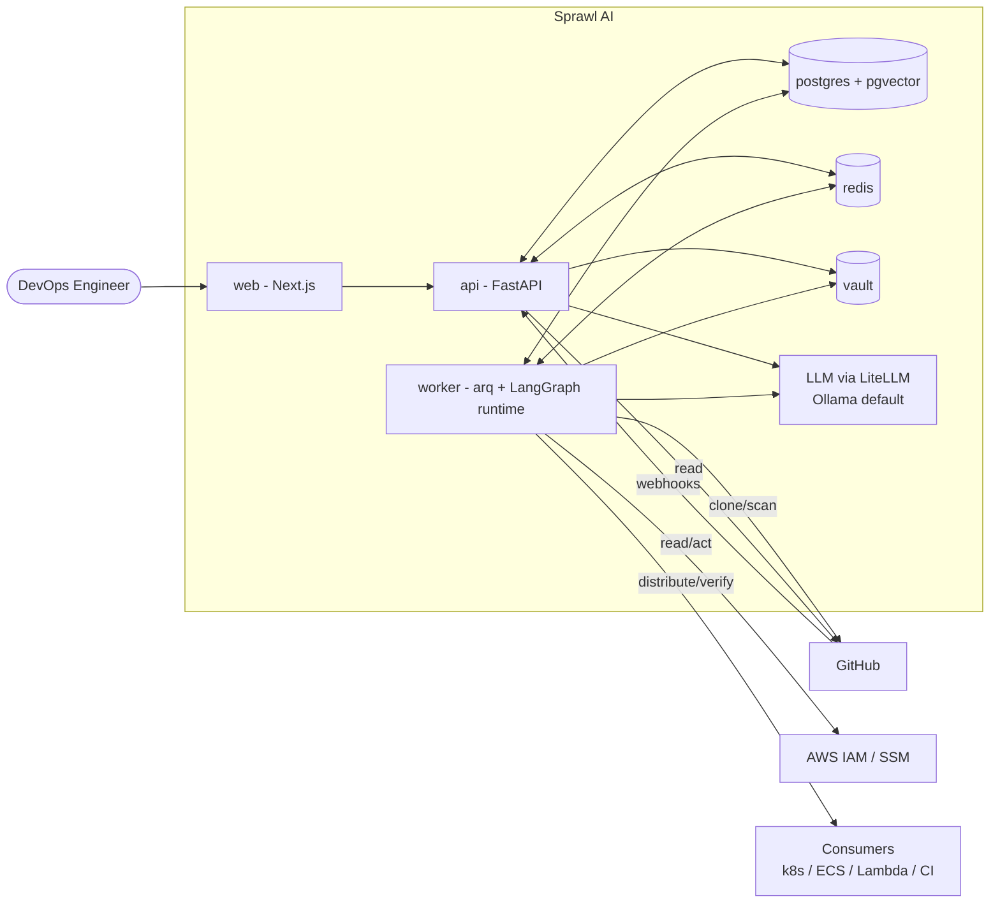
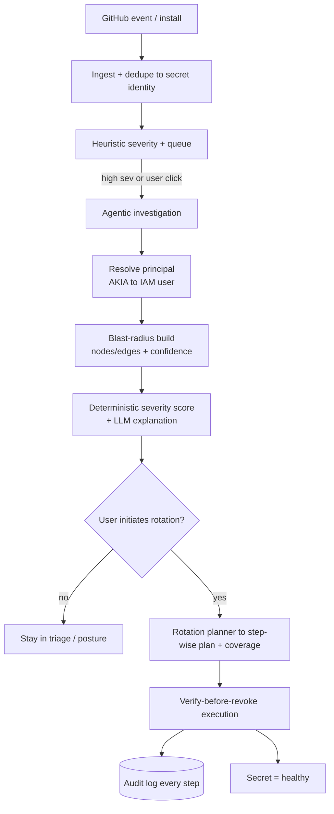
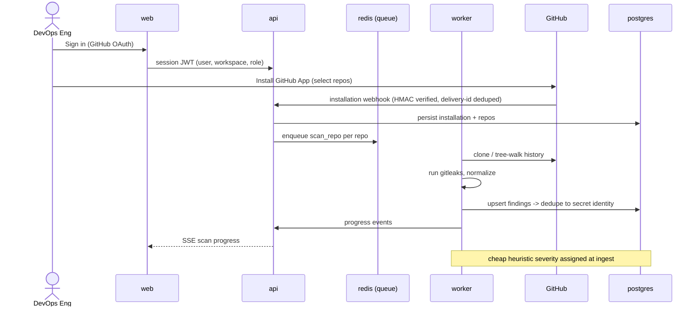
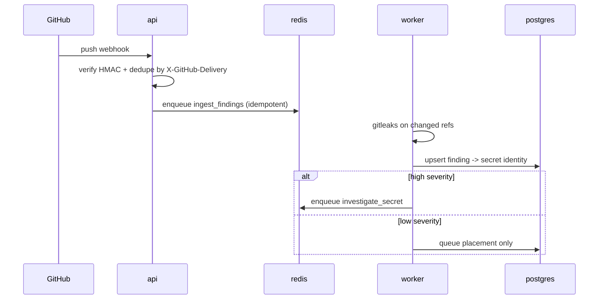
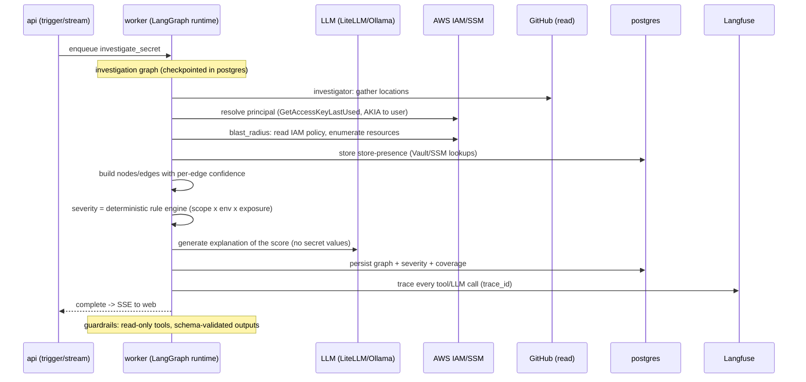
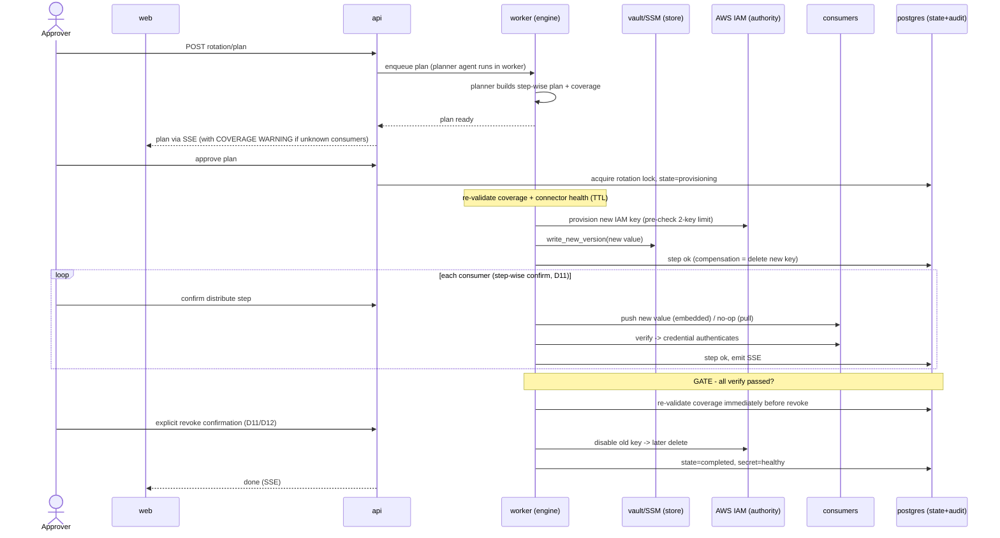
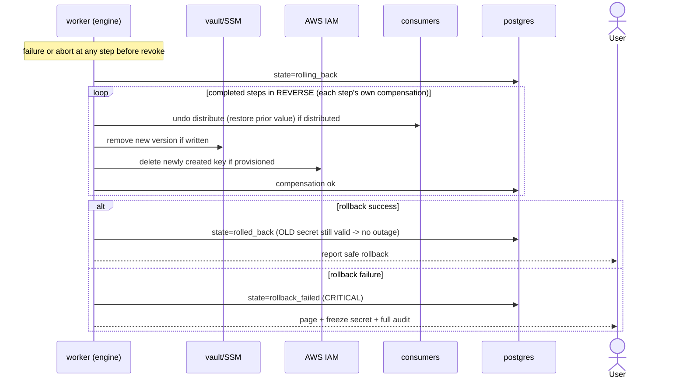
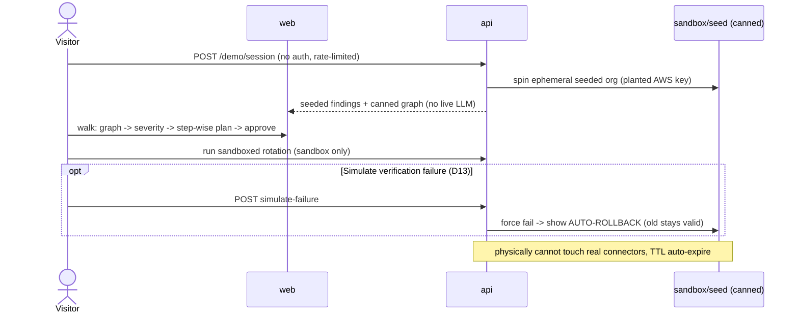
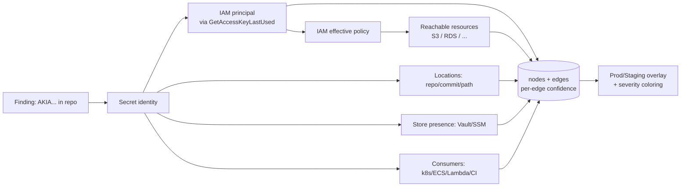
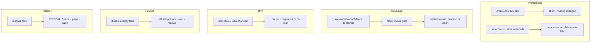

# Phase 6 — Architecture Flow

> End-to-end flow + sequence diagrams for the critical paths: event ingestion → agentic
> investigation → blast-radius build → severity → safe rotation → audit, plus rollback and
> demo flows. Builds on the [Tech Spec](./05-tech-spec.md). Diagrams use Mermaid.

---

## Components referenced (from §5.1)

`web` (Next.js) · `api` (FastAPI) · `worker` (arq) · `postgres` (PG16+pgvector) ·
`redis` · `vault` · `ollama`/LLM (via LiteLLM) · external: **GitHub**, **AWS (IAM/SSM)**,
**consumers** (k8s/ECS/Lambda/CI).

---

## 6.1 System context (level 1)

---

## 6.2 End-to-end pipeline (happy path)

---

## 6.3 Onboarding & historical scan

---

## 6.4 Live webhook ingestion (push event)

---

## 6.5 Agentic investigation → blast-radius build

---

## 6.6 Safe rotation — the critical path (verify-before-revoke)

**Invariants visible here:** plan TTL + re-validation (C6), step-wise confirmation (D11),
coverage gate (D12), revoke only after all verifies pass, every transition audited.

---

## 6.7 Rollback path (failure before the gate)

---

## 6.8 Demo mode (no-auth, sandbox, canned)

---

## 6.9 Blast-radius graph data flow

Each edge carries a **confidence** (high/medium/low, §3.7); incomplete/low-confidence
coverage drives the **coverage banner** and the rotation **coverage gate** (D12).

---

## 6.10 Key failure-mode flows

---

## 6.11 Cross-cutting flow notes

- **Idempotency + locks:** `lock:rotation:{secret}`, `lock:scan:{repo}`; every job keyed.
- **Streaming:** scan, investigation, and rotation progress all stream via **SSE** (primary).
- **Audit:** every node/step in the above diagrams emits an append-only, hash-chainable audit
  entry with actor + `correlation_id`.
- **Secret-zero:** `api`/`worker` authenticate to `vault` via platform-injected AppRole
  (§5.7.1) before any connector cred is read.
