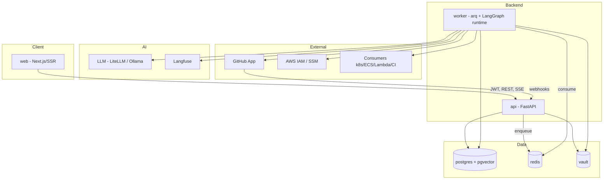
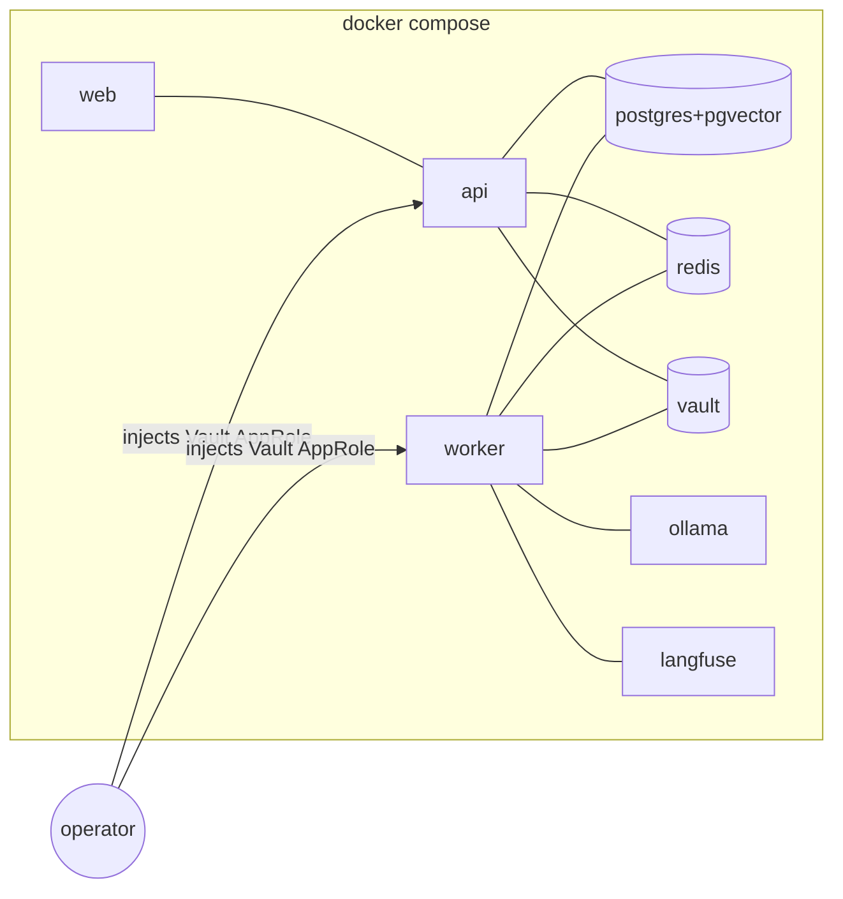

# Phase 7 — System Design (HLD)

> High-level design: components & service boundaries, data flow, queues, scaling, failure
> modes, security/secret-handling, and deployment topology. Builds on the
> [Tech Spec](./05-tech-spec.md) and [Architecture Flow](./06-architecture-flow.md).
> Scope = **MVP / Slice 0**, with forward-compat noted.

---

## Decisions anchored here

| # | Value |
|---|---|
| D6 | OSS + self-hostable → one `docker compose` |
| D8/D16 | Vault default store; rotation = deterministic PG state machine |
| D15 | LLM via LiteLLM, default local Ollama |
| §5.1 | Agents run in **worker**; `api` triggers + streams; `web` never touches DB/connectors |
| Safety | verify-before-revoke + rollback; agents propose, deterministic engine disposes |

---

## 7.1 Component model

### Component responsibilities (boundaries)

| Component | Owns | Must NOT |
|---|---|---|
| **web** | UI, SSR, JWT session, SSE consumption | touch DB/Vault/connectors |
| **api** | REST, webhook intake (HMAC), authz, enqueue, SSE fan-out | run agents inline; execute rotations |
| **worker** | LangGraph agent runtime, detection/scan, **rotation state machine**, connector calls | serve user HTTP |
| **postgres** | system of record: entities, graph, audit, embeddings, rotation + agent state | — |
| **redis** | queue, locks, caches, rate buckets | durable storage |
| **vault** | connector creds (D10) + a connector type | hold app business data |

---

## 7.2 Logical data domains (system of record = Postgres)

| Domain | Purpose |
|---|---|
| **Identity** | users, workspaces, roles (no server-side session store — identity claims travel in the signed JWT) |
| **Connectors** | connector config rows (auth → Vault handle), capability reports |
| **Sources** | GitHub installations, repos, scans |
| **Findings & Secrets** | raw findings → canonical secret identities, locations, health |
| **Blast-radius graph** | nodes, edges (typed, confidence-scored) |
| **Severity** | deterministic scores + explanations |
| **Rotation** | rotations, steps, confirmations, coverage |
| **Audit** | append-only, hash-chainable event log |
| **Vectors** | pgvector embeddings for dedupe/retrieval |

(Table-level schema is Phase 8.)

---

## 7.3 Data flow (control + data planes)

- **Control plane:** `web → api` (REST, JWT). `api` validates, authorizes, persists intent,
  and **enqueues** work. No long work on the request path.
- **Work plane:** `worker` consumes jobs, runs agents/connectors/rotation, persists results,
  emits progress.
- **Streaming plane:** `worker → (Redis pub/sub) → api → web` via **SSE** for scan,
  investigation, and rotation progress.
- **Secret plane:** real secret material is handled **only** in `worker` memory during
  rotation, written only to target store/consumer; never to `web`, never persisted/logged.

---

## 7.4 Queues & background processing

| Job | Trigger | Idempotency key | Notes |
|---|---|---|---|
| `scan_repo` | install / manual | `(repo_id, head_sha)` | full-history on connect |
| `ingest_findings` | webhook | `(delivery_id)` | dedupe before enqueue |
| `investigate_secret` | high-sev / user | `(secret_id, investigation_id)` | LangGraph investigation |
| `plan_rotation` | user | `(secret_id, plan_id)` | planner agent |
| `rotation_step` | engine | `(rotation_id, step_id)` | deterministic, resumable |

**Locks (Redis):** `lock:rotation:{secret}` (single active rotation), `lock:scan:{repo}`,
`lock:investigate:{secret}` (dedupe concurrent investigations).
**Retry/backoff:** `tenacity`; poison jobs → dead-letter + surfaced as degraded.

---

## 7.5 Scaling model (MVP → beyond)

| Concern | MVP | Scale path |
|---|---|---|
| API throughput | single `api` (async) | horizontal replicas behind LB (stateless, JWT) |
| Background work | single `worker` | scale workers by queue depth; shard by workspace |
| DB | one Postgres | read replicas; partition audit/findings by workspace; PgBouncer |
| Graph size | per-secret, lazy-expanded | cap node/edge count; paginate; (graph DB only if cross-secret) |
| LLM | local Ollama | hosted provider / GPU pool via LiteLLM routing |
| Ingestion bursts | Python + Redis | dedicated **Go** ingestion service (v1, D14) |
| Rotation durability | PG state machine | **Temporal** (v1, D16) |

**Statelessness:** `api` and `worker` hold no local state (all in PG/Redis/Vault) → scale out
freely. Heavy/expensive agent work is **severity-gated** (cost guardrail §2.6).

---

## 7.6 Failure modes & resilience

| Failure | Detection | Response |
|---|---|---|
| Webhook flood / replay | delivery-id dedupe, rate limit | drop dups; backpressure via queue |
| GitHub rate limit | API headers | backoff + ETA; resume scan |
| Connector degraded | periodic `test_connection` | mark degraded; **pause rotations** touching it |
| Agent/LLM down | call errors/timeouts | heuristic severity fallback; block planning with clear msg |
| Provision fails | step error | abort pre-change; nothing distributed |
| Verify fails | gate check | **auto-rollback**; old stays primary → no outage |
| Rollback fails | compensation error | `rollback_failed` **critical**: freeze + page + audit |
| Stale plan | TTL + re-validate | pause/re-prompt or re-plan |
| Worker crash mid-step | step keys + PG state | resume idempotently from last persisted step |
| Postgres down | health checks | API returns errors / serves only cached data where available; no writes; no rotations start |
| Vault sealed/unreachable | auth failure | block connector ops; alert; rotations cannot start |

**Core guarantee:** no single failure before the gate can cause an outage — the old secret
stays valid until verify passes; failures roll back.

---

## 7.7 Security & secret-handling design

| Layer | Design |
|---|---|
| **Root of trust** | platform-injected Vault AppRole (secret-zero, §5.7.1); Vault sealed at rest |
| **Connector creds** | only in Vault (D10), encrypted, write-only in UI, never logged |
| **Secret values** | engine-only, in-memory, transient; never in PG/logs/LLM |
| **Least privilege** | GitHub read-only for scan; rotation write scopes separate + opt-in; AWS AssumeRole + External ID; connector `path_prefix` scoping |
| **AuthN/Z** | GitHub OAuth → signed JWT; `api` authorizes (workspace, role); RBAC enforced v1 |
| **Transport** | TLS everywhere; HMAC-verified webhooks |
| **Audit integrity** | append-only + **hash-chained** entries (tamper-evident) |
| **Tenancy** | every row **workspace-scoped** (single-tenant MVP, forward-compatible) |
| **LLM data** | metadata/refs only, data-minimized; local Ollama keeps data on-box |
| **Demo isolation** | canned, sandboxed, rate-limited, ephemeral; cannot reach real connectors |

---

## 7.8 Deployment topology

### Self-host (canonical, D6)

> Co-location diagram (everything in one compose) — links show connectivity, not data-flow direction.

- One `docker compose up`; all services local; **$0** (local Ollama).
- Operator supplies the secret-zero (Vault AppRole) to **both `api` and `worker`** via
  env/secret file; Vault unseal documented.

### Hosted demo (D7)
- Deployed to **Fly.io / Railway**; **demo mode only** (seeded + sandbox, canned, no live LLM).
- No real connectors; rate-limited; small footprint.

### Environments
| Env | Purpose | Notes |
|---|---|---|
| local | dev / self-host | full compose, Ollama |
| demo | public showcase | demo mode only |
| (prod-real) | real connectors | post-MVP; requires hardened secrets + scaling path |

---

## 7.9 Observability & ops

- **Tracing:** Langfuse for agent/LLM (trace_id); structured JSON logs with correlation_id.
- **Metrics:** queue depth, job latency, rotation outcomes (success/rollback/critical),
  connector health — Prometheus-friendly endpoints.
- **Alerting (MVP-light):** `rollback_failed` and `vault unreachable` are page-worthy.
- **Runbooks:** secret-zero rotation, Vault unseal, dead-letter drain, stuck-rotation recovery.

---

## 7.10 Key HLD decisions & trade-offs

| Decision | Why | Trade-off |
|---|---|---|
| `api`/`worker` split | non-blocking agent/rotation work; clean security boundary | two processes vs one |
| Stateless services | trivial horizontal scaling | all state in PG/Redis/Vault |
| PG as single datastore (incl. graph) | simplicity, $0, one backup story | revisit graph DB only at scale |
| Redis for queue+locks | lightweight, already present | not durable → PG holds source of truth |
| Severity-gated agent work | cost/latency control | some low-sev items get heuristic-only |
| SSE over WS | simpler, proxy-friendly, one-way fits | no client→server stream (not needed) |
